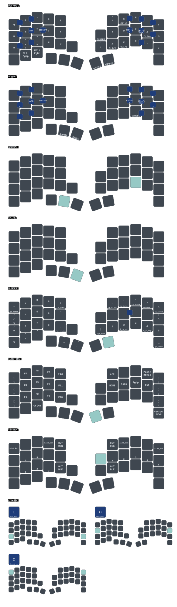

# moNa2 PAW3222 ZMK Firmware

ZMK firmware configuration for **moNa2: Right-Hand Trackball Version**.

This version uses the **PAW3222** optical sensor for trackball input.

## Features

- ZMK firmware
- 42 keys
- Low-profile design
- Fully wireless
- 17 mm key pitch
- 25 mm trackball
- LED indicators
- Rear magnets
- PAW3222 trackball sensor

## Keymap

The keymap diagram is automatically regenerated by
[keymap-drawer](https://github.com/caksoylar/keymap-drawer) whenever the keymap
or its drawing configuration changes.

## Firmware

Firmware builds are generated by GitHub Actions. Download the latest build
artifacts from the repository's **Actions** page.
