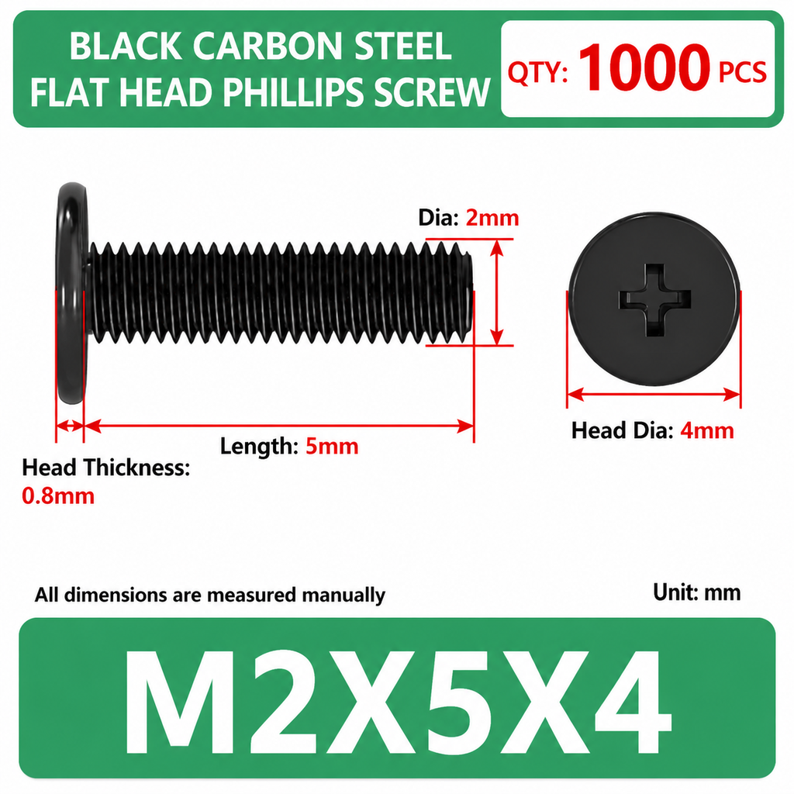
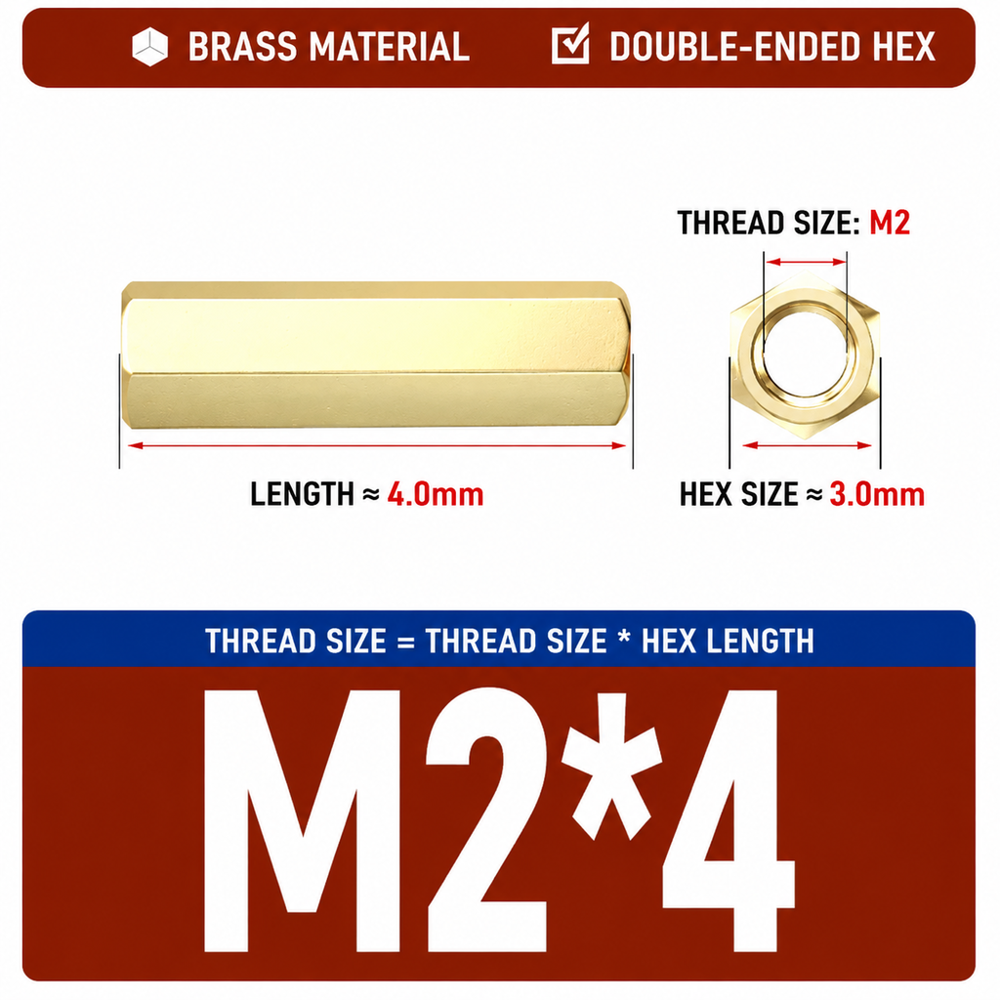
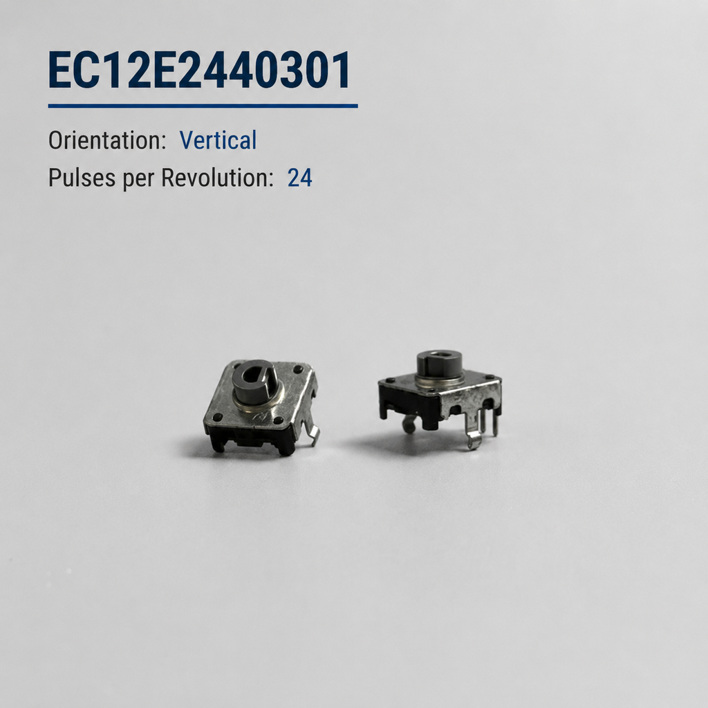
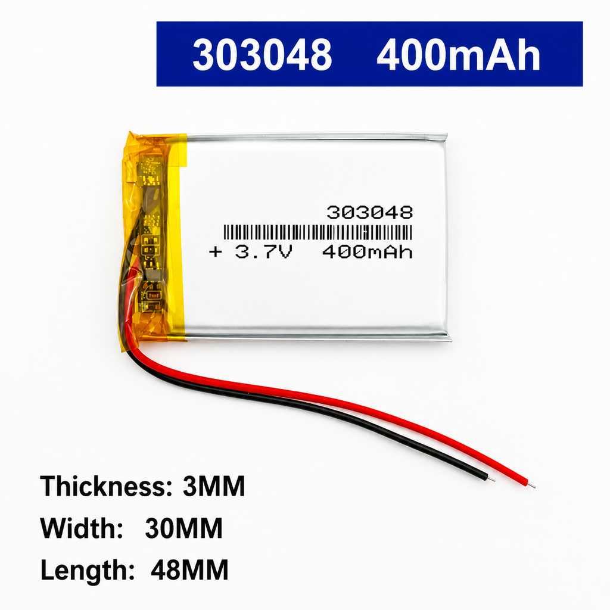
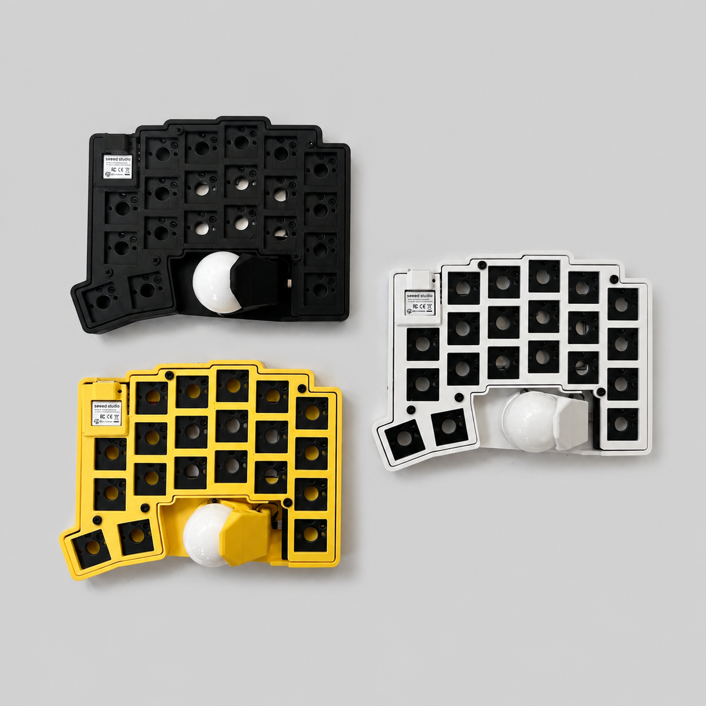

# moNa2 PAW3222 ZMK Firmware

ZMK firmware configuration for **moNa2: Right-Hand Trackball Version**.

This version uses the **PAW3222** optical sensor for trackball input.

## Features

- ZMK firmware
- 42 keys
- Low-profile design
- Fully wireless
- 17 mm key pitch
- 25 mm trackball
- LED indicators
- Rear magnets
- PAW3222 trackball sensor

## Keymap

The keymap diagram is automatically regenerated by
[keymap-drawer](https://github.com/caksoylar/keymap-drawer) whenever the keymap
or its drawing configuration changes.

## Hardware Specifications

| Component | Specification | Reference |
| --- | --- | --- |
| Screw | M2 x 5 x 4 |  |
| Standoff | M2 x 4 |  |
| Magnet | 6 mm diameter, 2 mm thickness | - |
| EC12 encoder | EC12E2440301 |  |
| Battery | 303048, 400 mAh, MX1.25 connector |  |
| FPC | Reverse-direction, 0.5 mm pitch, 30 mm length | - |

### Build Images

## Model Files

The `model` folder contains the 3D model files for the project.

- [Trackball case body - 25 mm](model/trackball-case-25mm-Body.stl)

## Firmware

Firmware builds are generated by GitHub Actions. Download the latest build
artifacts from the repository's **Actions** page.
