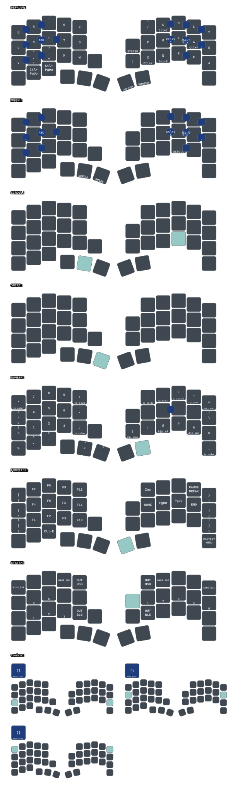
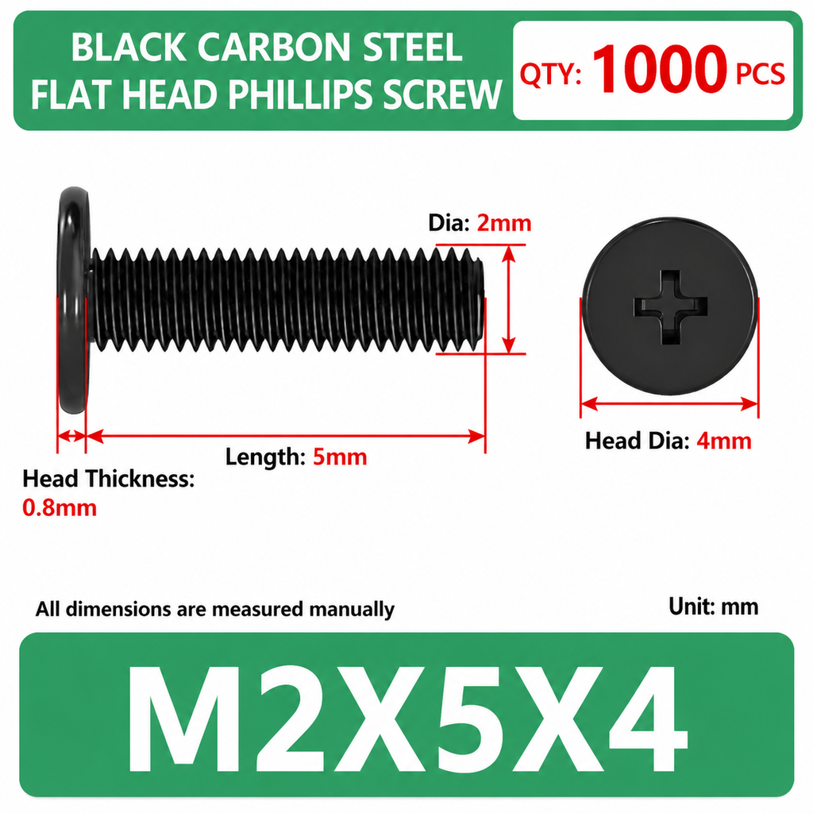
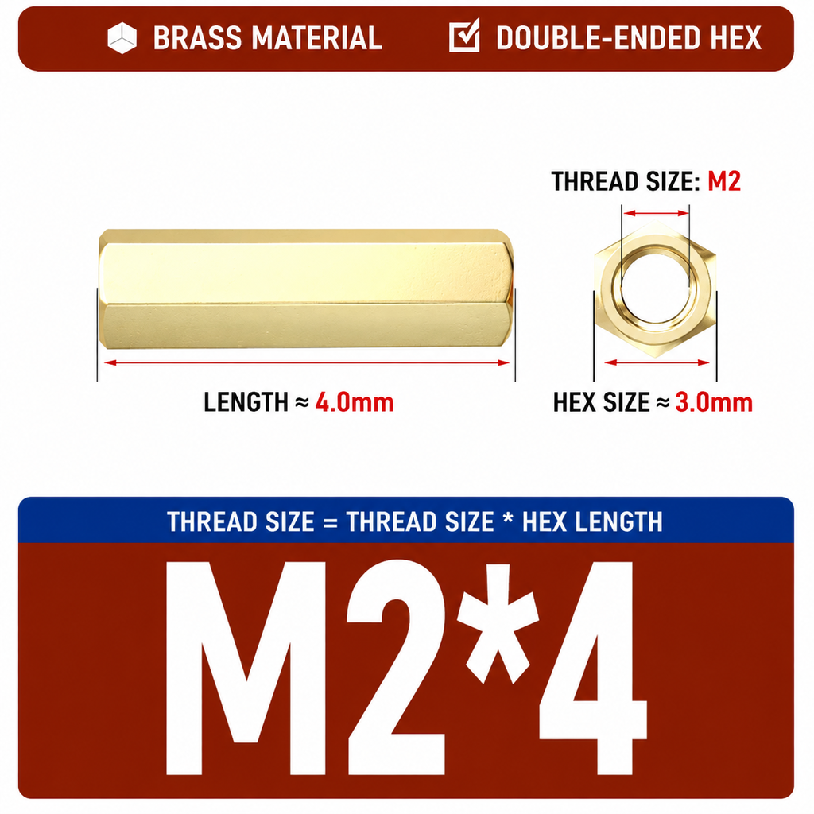
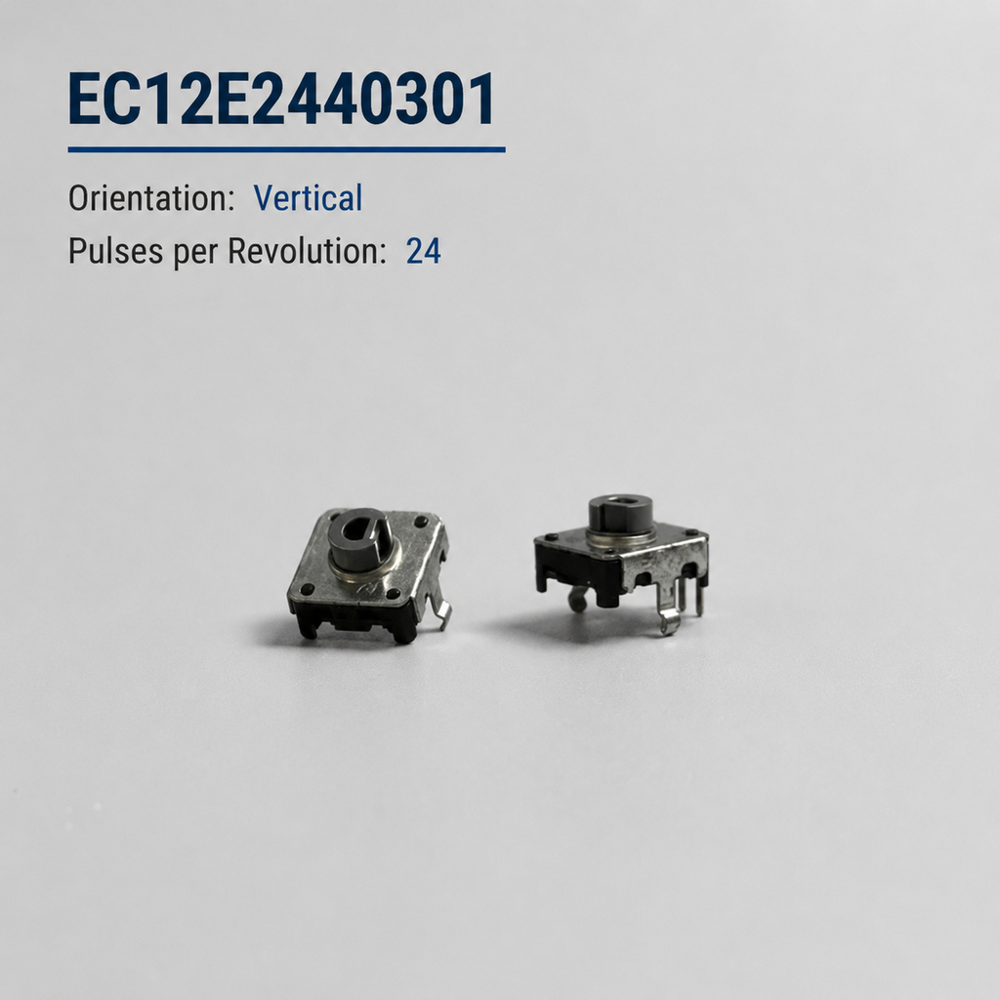
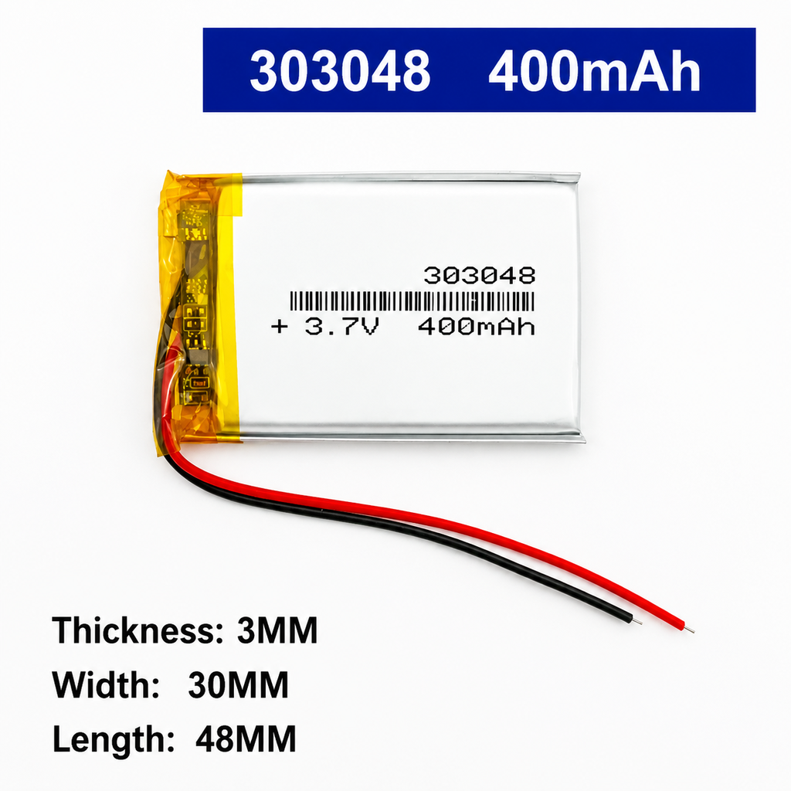
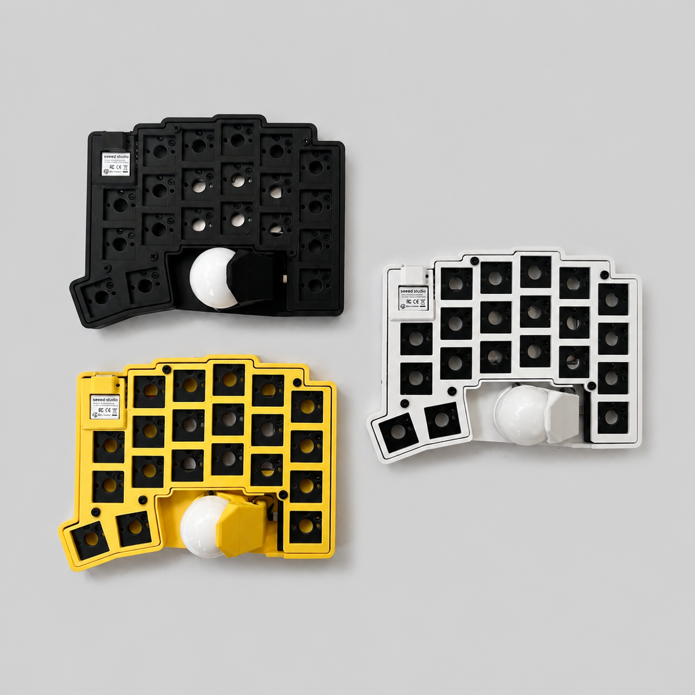

# moNa2 PAW3222 ZMK Firmware

ZMK firmware configuration for **moNa2: Right-Hand Trackball Version**.

This version uses the **PAW3222** optical sensor for trackball input.

## Features

- ZMK firmware
- 42 keys
- Low-profile design
- Fully wireless
- 17 mm key pitch
- 25 mm trackball
- LED indicators
- Rear magnets
- PAW3222 trackball sensor

## ZMK / Zephyr version

This config is built against **ZMK `main`** (Zephyr 4.1, HWMv2). The build target is the
ZMK board variant `xiao_ble//zmk`, and the shield requires the `seeed_xiao` interconnect.

Zephyr 4.1 migration notes:

- Board id `seeeduino_xiao_ble` → `xiao_ble//zmk`; the CI workflow reference moved from
  `build-user-config.yml@v0.3.0` to `@main`.
- `CONFIG_NFCT_PINS_AS_GPIOS` was removed from Kconfig. The nRF52840 NFC pins
  (P0.09/P0.10), which moNa2 uses as GPIOs, are switched in the devicetree instead
  (`boards/shields/mona2/boards/xiao_ble_zmk.overlay`).
- Status advertisement is configured on the central half only (`config/mona2_r.conf`).
  ZMK compiles the keymap/layer/event code for the central side of a split only, so the
  prospector module cannot link in a peripheral build.

### Known external issue

`zmk-input-processor-threshold-temp-layer` (pinned to `main`) still calls
`zmk_keymap_layer_activate()` / `zmk_keymap_layer_deactivate()` with the pre-`main`
signature, so it does not compile against ZMK `main`. The required one-line-per-call fix
is in [`patches/`](patches) — apply it on a fork (or vendor the module) and point
`config/west.yml` there until upstream catches up.

### Local build note

With Zephyr SDK 0.17.4 the toolchain's bundled picolibc conflicts with Zephyr 4.1's
`libc/picolibc/locks.c`. Build with `-DCONFIG_PICOLIBC_USE_MODULE=y` (or use the SDK
version ZMK's Docker image ships). Not needed for the GitHub Actions builds.

## Keymap

The keymap diagram is automatically regenerated by
[keymap-drawer](https://github.com/caksoylar/keymap-drawer) whenever the keymap
or its drawing configuration changes.

## Hardware Specifications

| Component | Specification | Reference |
| --- | --- | --- |
| Screw | M2 x 5 x 4 |  |
| Standoff | M2 x 4 |  |
| Magnet | 6 mm diameter, 2 mm thickness | - |
| EC12 encoder | EC12E2440301 |  |
| Battery | 303048, 400 mAh, MX1.25 connector |  |
| FPC | Reverse-direction, 0.5 mm pitch, 30 mm length | - |

### Build Images

## Model Files

The `model` folder contains the 3D model files for the project.

- [Trackball case body - 25 mm](model/trackball-case-25mm-Body.stl)

## Firmware

Firmware builds are generated by GitHub Actions. Download the latest build
artifacts from the repository's **Actions** page.
